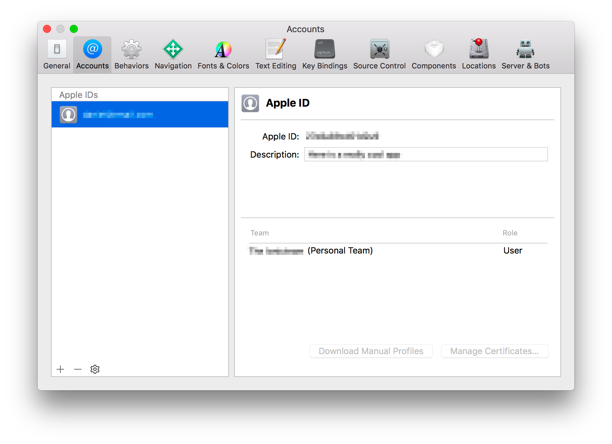
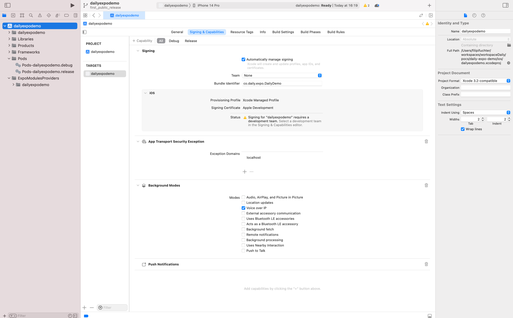

# react-native-daily-js-playground

A simple app showcasing `react-native-daily-js`, the [Daily](https://www.daily.co) library for React Native working together with [Expo](https://docs.expo.dev/introduction/expo/).

## Usage

### Expo requirements

This project cannot be used with an [Expo Go](https://docs.expo.dev/workflow/expo-go/) app because [it requires custom native code](https://docs.expo.io/workflow/customizing/).

When a project requires custom native code or a config plugin, we need to transition from using [Expo Go](https://docs.expo.dev/workflow/expo-go/)
to a [development build](https://docs.expo.dev/development/introduction/).

More details about the custom native code used by this demo can be found in [rn-daily-js-expo-config-plugin](https://github.com/daily-co/rn-daily-js-expo-config-plugin).

### Building remotely

If you do not have experience with Xcode and Android Studio builds or do not have them installed locally on your computer, you will need to follow [this guide from Expo to use EAS Build](https://docs.expo.dev/development/create-development-builds/#create-and-install-eas-build).

### Building locally

You will need to have installed locally on your computer:
- [Xcode](https://developer.apple.com/xcode/) to build for iOS;
- [Android Studio](https://developer.android.com/studio) to build for Android;

#### Install the demo dependencies

```bash
cd DailyPlayground

# Use the version of node specified in .nvmrc
nvm i

# Install dependencies
npm i

# Before a native app can be compiled, the native source code must be generated.
npx expo prebuild
```

#### Running on Android

After plugging in an Android device [configured for debugging](https://developer.android.com/studio/debug/dev-options), run the following command:

```
npm run android
```

#### Running on iOS

First, you'll need to do a one-time setup. This is required to build to a physical device.

If you're familiar with Xcode, open `ios/DailyPlayground.xcworkspace` and, in the target settings, provide a development team registered with Apple.

If you're newer to Xcode, here are some more detailed instructions to get you started.

First, open the project in Xcode. Make sure to specifically select `DailyPlayground.xcworkspace` from `/DailyPlayground/ios`. The `/ios` directory will have been generated by running `npx expo prebuild` as instructed above. This is also a good time to plug in your iOS device to be sure the following steps are successful.

From the main menu, select `Settings` and then `Accounts`. Click the `+` sign to add an account (e.g. an Apple ID).



Once an account is added, perform the following steps:

1. Close `Settings`.
1. Select the folder icon in the top left corner.
1. Select `DailyPlayground` from the side panel
1. Navigate to `Signing & Capabilities` in the top nav bar.
1. Open the "Team" dropdown
1. Select the account added in the previous step.

The "Signing Certificate" section should update accordingly with your account information.



**Troubleshooting common errors:**

- If you see the error `Change your bundle identifier to a unique string to try again`, update the "Bundle Identifier" input in `Signing & Capabilities` to make it unique. This should resolve the error.

- If you see an error that says `Xcode was unable to launch because it has an invalid code signature, inadequate entitlements or its profile has not been explicitly trusted by the user`, you may need to update the settings on your iPhone to enable the required permissions as follows:

1. Open `Settings` on your iPhone
1. Select `General`, then `Device Management`
1. Click `Trust` for DailyPlayground

- You may also be prompted to enter you login keychain password. Be sure to click `Always trust` to avoid the prompt showing multiple times.

After, run the following command:
```
npm run ios
```

---

### Room configuration

To keep things simple, a one-time, temporary Daily room is used. To use one of your own rooms, update the object returned in `/DailyPlayground/api.ts`.

```js
async function createRoom(): Promise<{ url: string }> {
  let response = await fetch(newRoomEndpoint),
    room = await response.json();
  return room;

  // Comment out the above and uncomment the below, using your own URL
  // return { url: "https://your-domain.daily.co/hello" };
}
```

As a reminder, you can create and configure rooms through your [Daily dashboard](https://dashboard.daily.co/rooms) or through calls to the [Daily REST API](https://docs.daily.co/reference#rooms).

---

### Interactive debugging

Ever since the [introduction of synchronous methods](https://github.com/react-native-webrtc/react-native-webrtc/commit/1fbe7e14bf540e1651c98ee11fc11f690f61f622) to `react-native-webrtc`, the common approach of using the [Chrome dev tools for interactive debugging](https://reactnative.dev/docs/debugging#chrome-developer-tools) sadly will not work.

Fear not! You can still do interactive debugging. How to do so will depend on the device you're debugging on as well as whether or not you're using the [Hermes JavaScript engine](https://reactnative.dev/docs/hermes):

- On Android, you _must_ [enable Hermes](https://reactnative.dev/docs/hermes#android) to debug interactively. Once you've done so, you'll be able to debug using the [Chrome inspector](https://reactnative.dev/docs/hermes#debugging-js-on-hermes-using-google-chromes-devtools).

- On iOS, you can debug with or without Hermes. If you're not using Hermes, you can debug using the [Safari dev tools](https://reactnative.dev/docs/debugging#safari-developer-tools). If you are [using Hermes](https://reactnative.dev/docs/hermes#ios), you can debug using the [Chrome inspector](https://reactnative.dev/docs/hermes#debugging-js-on-hermes-using-google-chromes-devtools).

- Starting with **React Native 0.70**, Hermes is already enabled by default for both iOS and Android, so unless you have disabled it, you should be good to go.

To give yourself access to helpful globals from the console, uncomment the following block in `App.tsx`:

```ts
/**
 * Uncomment to set up debugging globals.
 */
useEffect(() => {
  const g = global as any;
  g.Daily = Daily;
  g.callObject = callObject;
}, [callObject]);
```

### React Native Debugger

If you're looking to inspect specific components, update styles, or inspect network calls, [React Native Debugger](https://github.com/jhen0409/react-native-debugger) can also be helpful for debugging.
